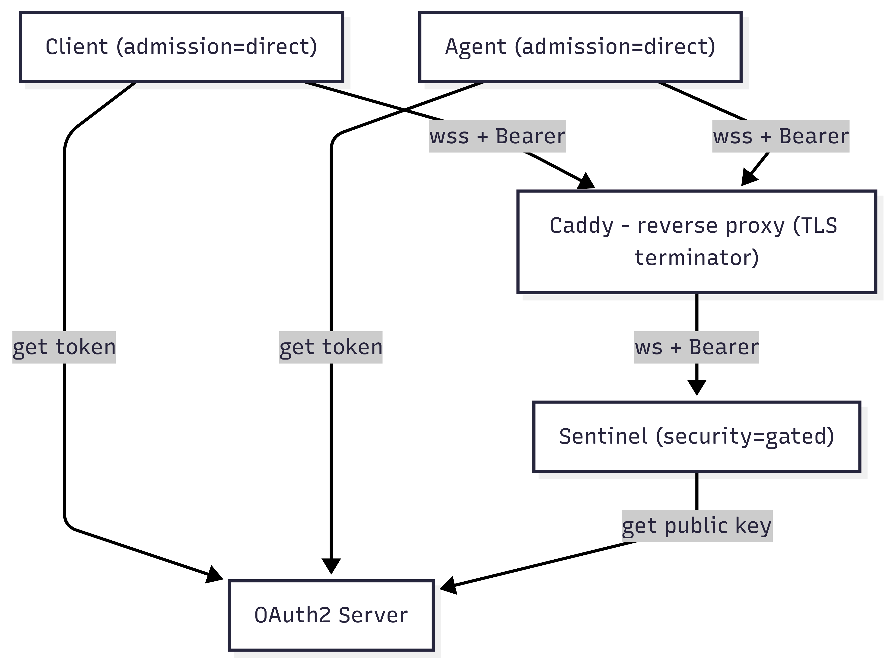

# Gated Admission Example — OAuth2 Auth (No Overlay Encryption)

This example demonstrates how to protect a Naylence fabric using **OAuth2 client-credentials** admission with **security profiles** and **admission profiles**. A sentinel validates bearer tokens issued by a local OAuth2 server, gating access to agents and clients. Transport TLS is terminated by **Caddy**, and Naylence's overlay encryption is **not enabled** in this example.

> **📝 Note:** This is the **TypeScript/Node.js** version. A Python version is available in `naylence-examples-python/examples/security/gated`.

## Architecture diagram



> ⚠️ **Security scope:** This example focuses only on **admission/auth** using OAuth2 tokens. TLS is handled by Caddy (reverse proxy). Naylence overlay encryption (message-level) is not used here. The included OAuth2 server is a **dev-only utility**; do not use it in production.

---

## What you'll learn

- Running a Naylence **sentinel** with `security profile = gated`.
- Running a Naylence **agent** with `admission profile = direct` (connects to sentinel using a JWT).
- Running a Naylence **client** with `admission profile = direct`.
- Using a simple OAuth2 server (Node.js implementation) to issue tokens for both agents and clients.
- Configuring security and admission with **profiles** instead of raw config.

---

## Why so many files?

You'll notice this example has more moving parts than the earlier ones. In practice, we could have just checked demo credentials straight into git and everything would work out-of-the-box.

We deliberately chose not to do that. Even though these credentials would only ever be test values, checking secrets into version control is a bad security practice. To stay true to Naylence's security philosophy, we instead generate unique credentials at setup time and distribute them into the appropriate .env.\* files.

That decision adds a few extra files, but it also keeps the example aligned with real-world security hygiene:

- No static secrets in git

- Clear separation of roles (client, agent, sentinel, OAuth2 server)

- Automation via Make/generator script so you don't have to manage values by hand

---

## Components

- **docker-compose.yml** — runs all long-lived services:
  - **caddy** — reverse proxy, terminates TLS with internal CA.
  - **oauth2-server-internal** — dev-only OAuth2 provider (Node.js, client credentials flow).
  - **sentinel-internal** — Naylence fabric sentinel (`security profile = gated`).
  - **math-agent** — example agent (same RPC agent as in the distributed RPC example), configured with `admission profile = direct`.

- **src/client.ts** — TypeScript client, authenticates via OAuth2 and connects to the sentinel.
- **config/.env.client** — holds client configuration (token URL, client ID/secret, admission URL, CA cert).

**Profiles in use:**

- Sentinel: `FAME_SECURITY_PROFILE=gated`
- Agent: `FAME_ADMISSION_PROFILE=direct`
- Client: `FAME_ADMISSION_PROFILE=direct`

**Logical address**: `math@fame.fabric` (same as RPC example).

---

## Quick start

### Using Make (Recommended)

The easiest way to run this example is using the provided Makefile, which automates the entire workflow:

```bash
make start
make run
```

**Build and run workflow:**

```bash
# Generate secrets and start services
make start

# In another terminal, run the client
make run
```

**Why use Make?**

- **Automated setup**: No manual configuration of credentials or environment files
- **Consistent secrets**: Ensures all services use the same generated client ID and secret
- **Streamlined workflow**: Complete end-to-end demonstration with simple commands
- **Error prevention**: Eliminates common setup mistakes like mismatched credentials

**Other Make targets:**

```bash
make init        # Generate secrets and .env files only
make build       # Build Docker image
make start       # Start Docker services (includes init)
make run         # Run the TypeScript client
make run-verbose # Run the TypeScript client with debug logging
make stop        # Stop Docker services
make clean       # Remove generated files and secrets
```

### Manual setup (Alternative)

If you prefer to run steps manually:

1. **Generate secrets and environment files**

```bash
node scripts/generate-secrets.mjs
```

This creates:

- `config/.env.client`, `config/.env.agent`, `config/.env.oauth2-server`, `config/.env.sentinel` with unique credentials
- `config/secrets/oauth2-credentials.txt` with OAuth2 client configuration

2. **Start services**

```bash
docker compose up -d
```

This brings up Caddy (TLS), OAuth2 server (Node.js), sentinel (gated), and the math agent (direct admission).

3. **Run the client**

```bash
make run
```

or

```bash
docker compose run --rm \
  -v caddy-data:/data/caddy:ro \
  --env-file=config/.env.client \
  naylence \
  node gated/client.mjs
```

The client will:

- Load configuration from `config/.env.client`.
- Fetch a bearer token from the OAuth2 dev server (using client credentials).
- Connect to the sentinel at `wss://localhost/fame/v1/attach/ws/downstream`.
- Call the math agent's RPCs.

### Example output

```
7
42
0 1 1 2 3 5 8 13 21 34
```

3. **Stop services**

```bash
docker compose down --remove-orphans
# or
make stop
```

---

## Client env vars reference (config/.env.client)

Example `config/.env.client`:

```ini
FAME_ADMISSION_PROFILE=direct
FAME_DIRECT_ADMISSION_URL=wss://localhost/fame/v1/attach/ws/downstream
FAME_ADMISSION_TOKEN_URL=https://localhost/oauth/token
FAME_ADMISSION_CLIENT_ID=<YOUR_TEST_CLIENT_ID>
FAME_ADMISSION_CLIENT_SECRET=<YOUR_TEST_CLIENT_SECRET>
FAME_JWT_AUDIENCE=fame.fabric
SSL_CERT_FILE=/data/caddy/pki/authorities/local/root.crt
```

- **FAME_ADMISSION_PROFILE** — admission mode (`direct` means connect directly to sentinel using a JWT).
- **FAME_DIRECT_ADMISSION_URL** — sentinel attach URL (through Caddy).
- **FAME_ADMISSION_TOKEN_URL** — OAuth2 server token endpoint.
- **FAME_ADMISSION_CLIENT_ID/SECRET** — OAuth2 client credentials.
- **FAME_JWT_AUDIENCE** — must match sentinel's trusted audience.
- **SSL_CERT_FILE** — path to Caddy's internal root CA cert (mounted from Docker volume).

---

## Agent env vars reference (config/.env.agent)

The agent uses the **same variables as the client**, but since it runs inside Docker Compose, the values reference internal service names:

```ini
SSL_CERT_FILE=/data/caddy/pki/authorities/local/root.crt
FAME_DIRECT_ADMISSION_URL=wss://sentinel-internal/fame/v1/attach/ws/downstream
FAME_ADMISSION_PROFILE=direct
FAME_ADMISSION_TOKEN_URL=https://oauth2-server-internal/oauth/token
FAME_ADMISSION_CLIENT_ID=<YOUR_TEST_CLIENT_ID>
FAME_ADMISSION_CLIENT_SECRET=<YOUR_TEST_CLIENT_SECRET>
FAME_JWT_AUDIENCE=fame.fabric
```

---

## Dev OAuth2 server env vars reference (config/.env.oauth2-server)

```ini
FAME_JWT_ISSUER=https://oauth2-server-internal
FAME_JWT_CLIENT_ID=<YOUR_TEST_CLIENT_ID>
FAME_JWT_CLIENT_SECRET=<YOUR_TEST_CLIENT_SECRET>
FAME_JWT_AUDIENCE=fame.fabric
```

**Implementation note:** The TypeScript version includes a minimal Node.js HTTP server (`src/oauth2-server.ts`) that implements the OAuth2 client credentials flow. This is a **development-only** replacement for the Python runtime's built-in `python -m naylence.fame.fastapi.oauth2_server` module.

---

## Sentinel env vars reference (config/.env.sentinel)

The sentinel does not connect upstream, but it enforces gated security:

```ini
SSL_CERT_FILE=/data/caddy/pki/authorities/local/root.crt
FAME_SECURITY_PROFILE=gated
FAME_JWT_TRUSTED_ISSUER=https://oauth2-server-internal
FAME_JWT_AUDIENCE=fame.fabric
```

---

## TypeScript-specific implementation details

### OAuth2 Server (Node.js)

The TypeScript version implements a minimal OAuth2 server using Node.js's built-in `http` module:

```typescript
// src/oauth2-server.ts
import { createServer } from "node:http";
import { createHmac, randomBytes } from "node:crypto";

// Issues JWT tokens with HS256 signatures
// Exposes /oauth/token and /.well-known/jwks.json endpoints
// Configured via environment variables
```

This server:

- Implements OAuth2 client credentials grant type
- Generates JWT tokens with `iss`, `sub`, `aud`, `exp`, `iat` claims
- Uses HS256 (HMAC-SHA256) for token signing
- Provides JWKS endpoint for public key discovery

**⚠️ Development only:** This OAuth2 implementation is for testing and demonstration. Production deployments should use established identity providers like Keycloak, Auth0, or Okta.

### Client Configuration

The TypeScript client uses the `CLIENT_CONFIG` factory from `naylence-agent-sdk`:

```typescript
import { Agent, CLIENT_CONFIG } from "@naylence/agent-sdk";
import { withFabric } from "@naylence/runtime";

await withFabric({ rootConfig: CLIENT_CONFIG }, async () => {
  const agent = Agent.remoteByAddress("math@fame.fabric");
  const sum = await agent.add({ x: 3, y: 4 });
  console.log(sum);
});
```

The `CLIENT_CONFIG` factory automatically:

- Reads environment variables for OAuth2 configuration
- Acquires bearer tokens using client credentials
- Injects tokens into connection grants for admission
- Manages TLS certificate validation

---

## Notes

- The OAuth2 server included here is for **development only**. In production, use a real identity provider (Keycloak, Auth0, Okta, etc.).
- Always run Caddy (or another reverse proxy) for TLS termination; Naylence does **not** provide TLS itself.
- Overlay encryption (end-to-end message security) is a separate layer, demonstrated in later examples.

---

## Troubleshooting

- **401 Unauthorized** — check that client/agent ID & secret match OAuth2 server config; verify `FAME_JWT_AUDIENCE` matches sentinel's config.
- **TLS errors** — confirm `SSL_CERT_FILE` points to Caddy's root CA cert (mounted at `/data/caddy/pki/authorities/local/root.crt`).
- **WS connection refused** — ensure Docker Compose is up; Caddy listens on `443`.
- **Module not found** — ensure you've built the TypeScript code with `npm run build` or the Docker image contains compiled `.mjs` files.

---

This example demonstrates **admission gating with OAuth2** using **profiles**: sentinel in `gated` mode, client and agent in `direct` mode. TLS remains at the proxy; overlay encryption is left for later examples.
